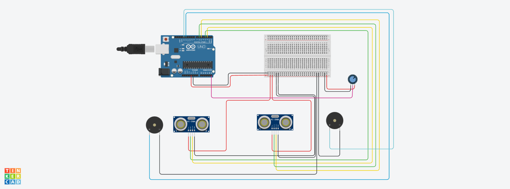
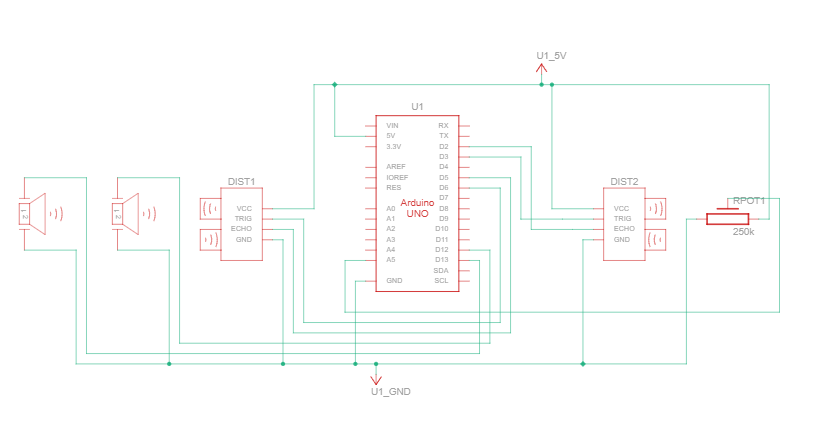

<div align="center">


# TYREZIA - Sistema de Navegação Sonar para Auxílio Visual

</div>

## Resumo do Projeto e Objetivo

O **TYREZIA (EchoSense)** é um protótipo de sistema eletrônico embarcado de baixo custo, desenvolvido como projeto final (TCC/Projeto de Período) com o objetivo de **aumentar a autonomia e a segurança** de indivíduos com deficiência visual.

O dispositivo opera como um **Óculos Guia Sonar**, utilizando a tecnologia de **sensoriamento ultrassônico dual-channel** para a **detecção e mapeamento de obstáculos em tempo real**. O feedback é fornecido através de um sistema de **alerta auditivo estéreo direcional**, substituindo a dependência da bengala de forma complementar e não invasiva.

## Arquitetura e Princípio de Funcionamento

O sistema é baseado em um **microcontrolador Arduino** (ou equivalente), que orquestra a aquisição de dados e a emissão do feedback.

### 1. Aquisição de Dados (Dual-Channel Sensing)
* **Sensores:** Dois módulos ultrassônicos HC-SR04 estão dispostos em um arranjo **estéreo** (lateral esquerdo e lateral direito).
* **Método:** A função `lerDistancia()` executa o protocolo de medição por **Time-of-Flight (ToF)**. O microcontrolador envia um pulso de _trigger_ e mede a duração do pulso de _echo_ (`pulseIn`), calculando a distância $d$ em centímetros com base na velocidade do som $v_s$ (aproximadamente $340 \, \text{m/s}$):
    $$d = \frac{t_{\text{pulso}} \cdot v_s}{2}$$
    *A divisão por 2 é essencial, pois o tempo medido é de ida e volta do pulso.*

### 2. Lógica de Controle e Feedback Proporcional
* **Controle de Frequência:** O valor lido do **potenciômetro** é mapeado para definir a **frequência de ressonância base** (em Hz) do sinal sonoro (entre 300 Hz e 4000 Hz), permitindo a calibração auditiva do usuário.
* **Feedback Direcional:** A função `emitirSom()` processa as distâncias de forma independente para cada lado (esquerda/direita).
* **Modulação Temporal (Proporcional):** A **taxa de repetição** do alerta sonoro é **inversamente proporcional** à distância medida.
    * **Proximidade Crítica ($d < 100 \, \text{cm}$):** O sistema emite um _beep_ na frequência base definida.
    * **Intervalo de Repetição:** O `delay` entre os pulsos de _beep_ é diretamente proporcional à distância. Quanto menor a distância, menor o _delay_, resultando em um **alerta mais rápido e urgente**.
        > $\text{Intervalo} \propto d$


## Especificação de Hardware (BOM)

| Componente | Quantidade | Função e Parâmetros Chave |
| :--- | :--- | :--- |
| **Microcontrolador** | 1 | Arduino Uno (ou equivalente ATmega328P). **Plataforma de processamento central.** |
| **Sensor Ultrassônico** | 2 | Módulo HC-SR04. **Transdutores ultrassônicos para ToF sensing** ($\sim 2 \, \text{cm}$ a $400 \, \text{cm}$). |
| **Transdutor Acústico** | 2 | Buzzer Ativo/Passivo. **Saída de feedback auditivo estéreo.** |
| **Potenciômetro** | 1 | $10 \, \text{k}\Omega$. **Controle de calibração analógica da frequência** de saída. |
| **Alimentação** | 1 | Bateria $9 \, \text{V}$. **Fonte de energia independente** para portabilidade. |
| **Chave de Acionamento** | 1 | Chave Gangorra (liga/desliga). **Controle de energia do sistema.** |
| **Cabos/Conectores** | Vários | Fios Jumper. **Interconexão elétrica.** |

## Mapeamento de Pinos (Pinagem I/O)

| Módulo/Sinal | Pino Arduino | Variável no Sketch | Tipo de I/O |
| :--- | :--- | :--- | :--- |
| Sensor ESQ (Trigger) | D4 | `TRIG_ESQ` | Saída Digital |
| Sensor ESQ (Echo) | D3 | `ECHO_ESQ` | Entrada Digital |
| Sensor DIR (Trigger) | D6 | `TRIG_DIR` | Saída Digital |
| Sensor DIR (Echo) | D5 | `ECHO_DIR` | Entrada Digital |
| Buzzer DIREITO | D13 | `BUZZER_DIR` | Saída Digital (PWM via `tone`) |
| Buzzer ESQUERDO | D12 | `BUZZER_ESQ` | Saída Digital (PWM via `tone`) |
| Potenciômetro (Analog In) | A5 | `PINO_POT` | Entrada Analógica |

## Simulação e Protótipo Virtual (Tinkercad)

Para visualizar, simular ou duplicar o circuito e o código de forma interativa, utilize o link do nosso protótipo virtual criado no Autodesk Tinkercad Circuits.

| Plataforma | Link de Acesso |
| :--- | :--- |
| **Tinkercad Circuits** | [Acesse aqui o Protótipo TYREZIA](https://www.tinkercad.com/things/ay2kKYIZBEG-oculos-para-deficientes-visuais-av2-sistemas-digitais?sharecode=aVM2jFpdQ1QjEHgkH_xUzuhFRDBdHUYiTQKXp0c-ug4) |

## Galeria do Projeto

### Protótipo Físico

<div align="center">



_Foto de alta resolução do protótipo do dispositivo TYREZIA montado._

</div>

---

### Visão Esquemática

<div align="center">



_Diagrama de conexão (Ex: Fritzing ou Esquemático Eletrônico) que detalha a pinagem e interconexão dos componentes._

</div>

## Implementação (Sketch Arduino C++)

O código a seguir é a implementação do firmware de controle.

```cpp
// --- Definição de Constantes (Hardware Abstraction Layer) ---
#define TRIG_ESQ 4     // Pinagem de Trigger Esquerdo
#define ECHO_ESQ 3     // Pinagem de Echo Esquerdo
#define TRIG_DIR 6     // Pinagem de Trigger Direito
#define ECHO_DIR 5     // Pinagem de Echo Direito
#define BUZZER_DIR 13  // Pinagem do Transdutor Acústico Direito
#define BUZZER_ESQ 12  // Pinagem do Transdutor Acústico Esquerdo
#define PINO_POT A5    // Pinagem do Potenciômetro (Entrada Analógica)

// --- Variável Global para a Frequência Calibrada ---
int frequenciaBase = 0; 

// --- Função: Aquisição de Distância (Time-of-Flight) e Debug ---
/**
 * @brief Executa a medição de distância usando o sensor HC-SR04.
 * * @param pinoTrig Pino de Saída para o Trigger (pulso de 10µs).
 * @param pinoEcho Pino de Entrada para o Echo (medição da duração do pulso).
 * @param nomeSensor Nome do sensor para identificação no Serial Monitor.
 * @return int Distância calculada em centímetros (cm).
 */
int lerDistancia(int pinoTrig, int pinoEcho, String nomeSensor) {
  // Sequência de pulso para inicializar a medição
  digitalWrite(pinoTrig, LOW); 
  delayMicroseconds(2);
  digitalWrite(pinoTrig, HIGH);
  delayMicroseconds(10);
  digitalWrite(pinoTrig, LOW);

  // Mede a duração do pulso de retorno (Echo)
  long duration = pulseIn(pinoEcho, HIGH);
  // Conversão de tempo para distância (cm): t * v_s / 2
  int distance = duration * 0.034 / 2; 

  // Saída de Debug no Serial Monitor
  Serial.print(nomeSensor);
  Serial.print("Distance: ");
  Serial.print(distance);
  Serial.print(" cm | Freq: ");
  Serial.print(frequenciaBase);
  Serial.println(" Hz"); 
  
  return distance;
}

// --- Função: Geração de Feedback Auditivo (Modulação Temporal) ---
/**
 * @brief Emite um pulso de áudio no buzzer, com a taxa de repetição
 * inversamente proporcional à distância.
 * * @param distancia Distância do obstáculo em cm.
 * @param pinoBuzzer Pino de Saída para o Transdutor Acústico.
 */
void emitirSom(int distancia, int pinoBuzzer) {
  
  // Limiar de Deteccão: 100cm
  if (distancia < 100 && distancia > 0) {  
    // Emite o som na frequência calibrada
    tone(pinoBuzzer, frequenciaBase); 
    
    delay(50); // Duração do pulso de áudio
    
    noTone(pinoBuzzer);
    
    // Delay de repetição inversamente proporcional à urgência
    delay(distancia * 2);
  } else {
    noTone(pinoBuzzer); // Desliga o som fora do limiar
  }
}

// --- Configuração Inicial (SETUP) ---
void setup() {
  // Inicialização da Comunicação Serial (9600 bps)
  Serial.begin(9600);
  
  // Configuração dos pinos de I/O
  pinMode(TRIG_ESQ, OUTPUT); 
  pinMode(ECHO_ESQ, INPUT); 
  
  pinMode(TRIG_DIR, OUTPUT);
  pinMode(ECHO_DIR, INPUT);
  
  pinMode(BUZZER_DIR, OUTPUT);
  pinMode(BUZZER_ESQ, OUTPUT);
  
  
  Serial.println("TYREZIA - Sistema de Navegacao Sonar v1.1 Inicializado. Ajuste o Potenciometro (A5).");
}

// --- Loop Principal (LOOP) ---
void loop() {
  // Leitura Analógica do Potenciômetro (0-1023)
  int leituraPot = analogRead(PINO_POT); 
  
  // Mapeamento para Frequência de Resonância (300Hz a 4000Hz)
  frequenciaBase = map(leituraPot, 0, 1023, 300, 4000); 

  // Aquisição de Dados de Distância e Debug
  int distanciaEsq = lerDistancia(TRIG_ESQ, ECHO_ESQ, "Esq: ");
  int distanciaDir = lerDistancia(TRIG_DIR, ECHO_DIR, "Dir: ");
  
  // Geração de Feedback Auditivo Direcional
  emitirSom(distanciaEsq, BUZZER_ESQ);
  emitirSom(distanciaDir, BUZZER_DIR);
}

```

## Licença

MIT License

Copyright (c) 2025 Alice Sena

Permission is hereby granted, free of charge, to any person obtaining a copy
of this software and associated documentation files (the "Software"), to deal
in the Software without restriction, including without limitation the rights
to use, copy, modify, merge, publish, distribute, sublicense, and/or sell
copies of the Software, and to permit persons to whom the Software is
furnished to do so, subject to the following conditions:

The above copyright notice and this permission notice shall be included in all
copies or substantial portions of the Software.

THE SOFTWARE IS PROVIDED "AS IS", WITHOUT WARRANTY OF ANY KIND, EXPRESS OR
IMPLIED, INCLUDING BUT NOT LIMITED TO THE WARRANTIES OF MERCHANTABILITY,
FITNESS FOR A PARTICULAR PURPOSE AND NONINFRINGEMENT. IN NO EVENT SHALL THE
AUTHORS OR COPYRIGHT HOLDERS BE LIABLE FOR ANY CLAIM, DAMAGES OR OTHER
LIABILITY, WHETHER IN AN ACTION OF CONTRACT, TORT OR OTHERWISE, ARISING FROM,
OUT OF OR IN CONNECTION WITH THE SOFTWARE OR THE USE OR OTHER DEALINGS IN THE
SOFTWARE.

---


## Desenvolvedores e Contribuições

| | | |
|:----------------------------------------------------------:|:----------------------------------------------------------:|:----------------------------------------------------------:|
|  |  |  |
| **Alice Sena** | **Lucas Segundo** | **Luan Ventura** |
| Eletrônica | Prototipagem | Código (Firmware) |
| **[GitHub](https://github.com/alicessena)** - **[LinkedIn](https://www.linkedin.com/in/alicessenapereira/)** | **[GitHub](https://github.com/lucassegundo2)** - **[LinkedIn](https://www.linkedin.com/in/lucas-segundo-44a9a7349/)** | **[GitHub](https://github.com/luanvfm)** - **[LinkedIn](https://www.linkedin.com/in/luanven/)** |

---

<div align="center">
    <sub>Desenvolvido por Alice Sena, Lucas Segundo e Luan Ventura - 2025</sub>
